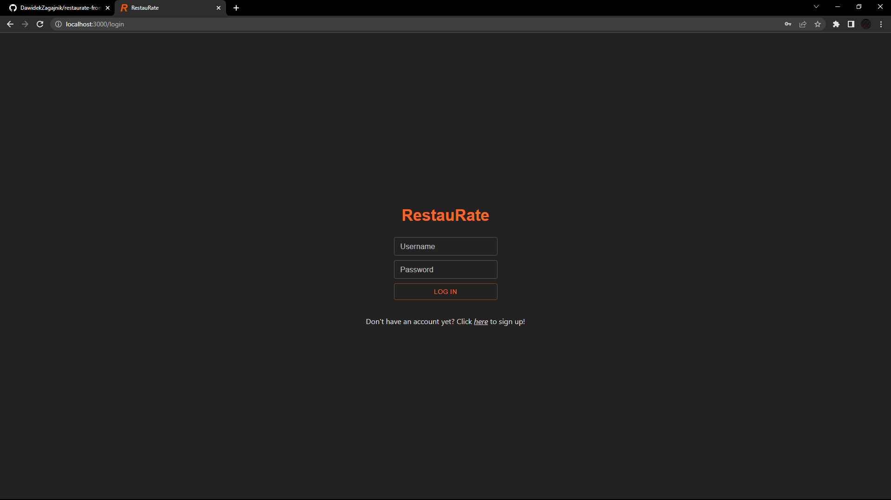
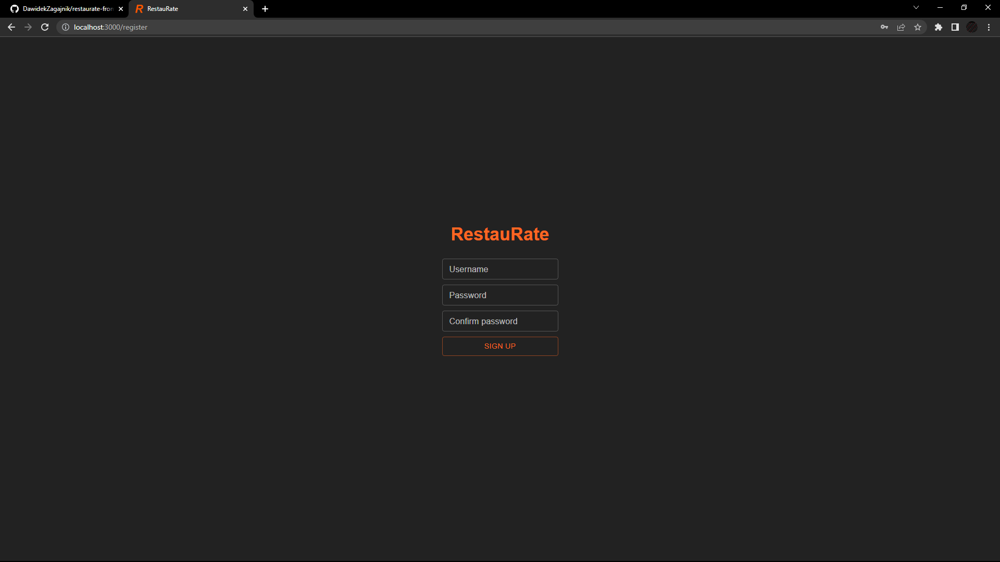
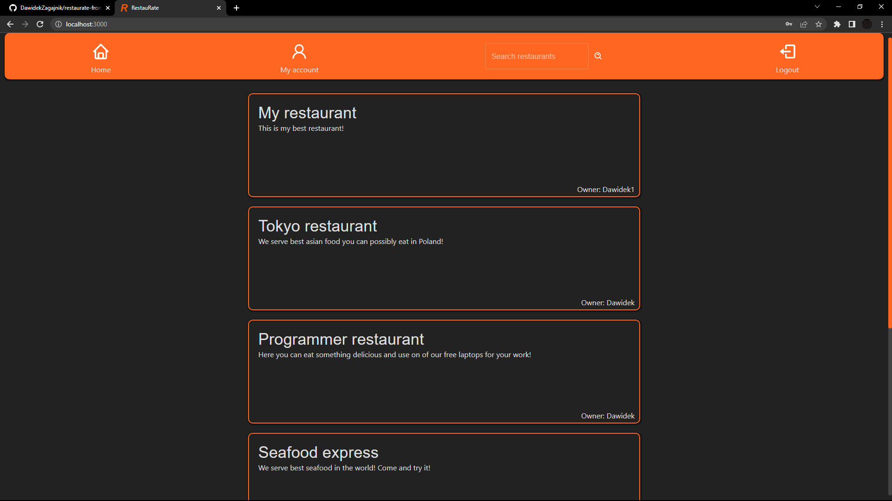
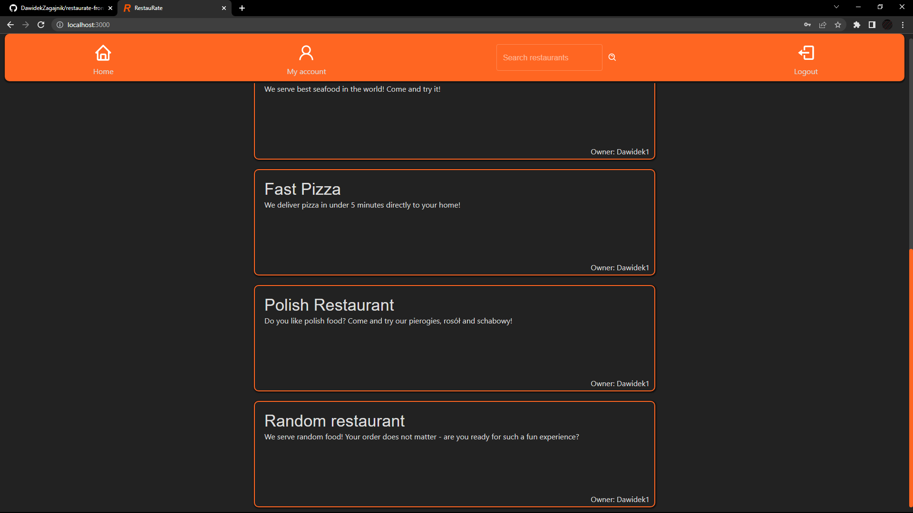
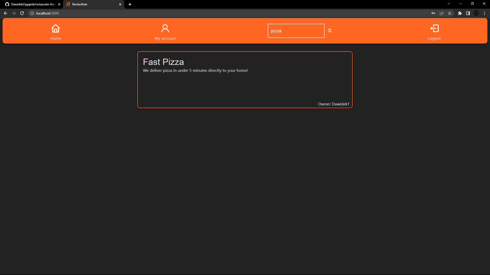
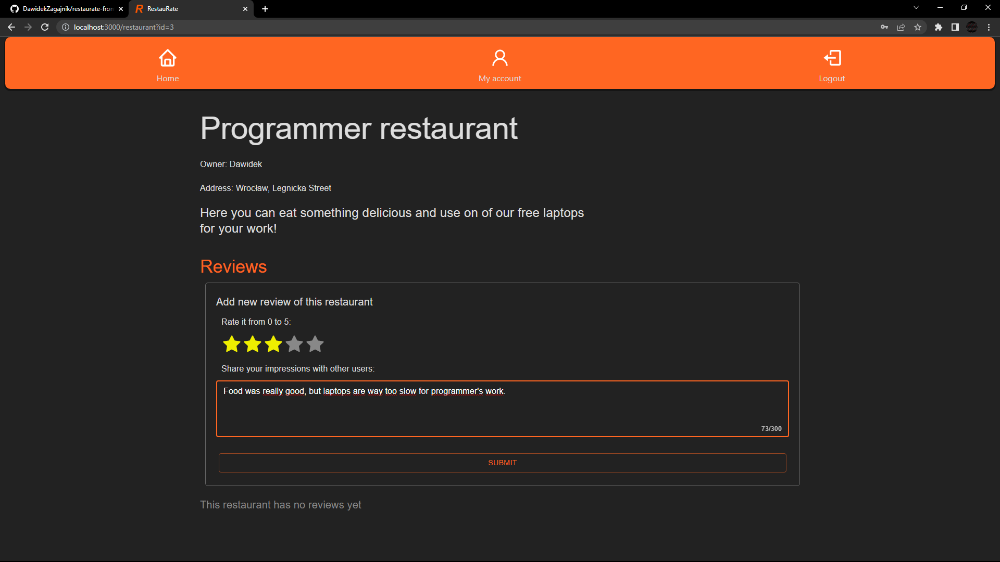
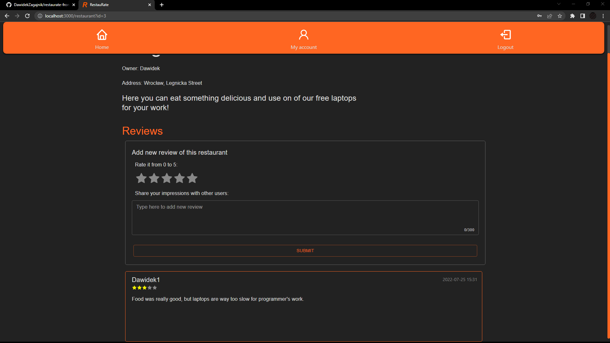
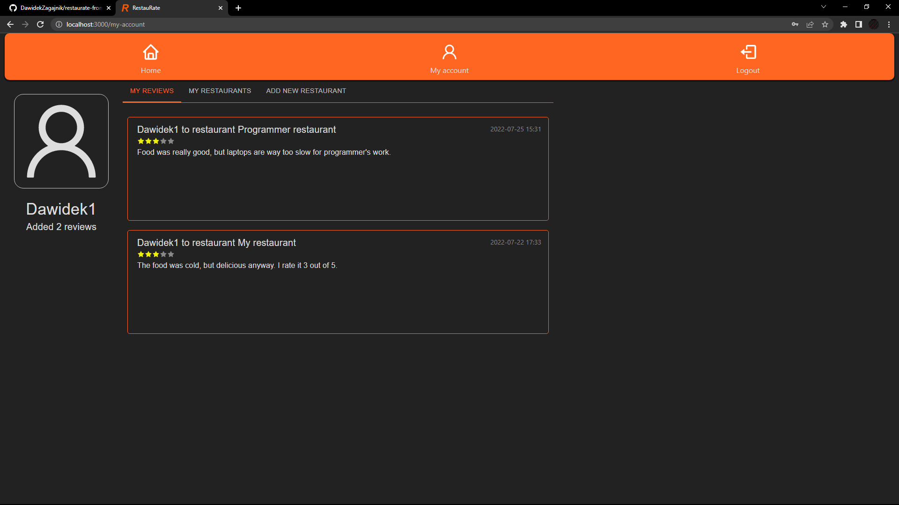
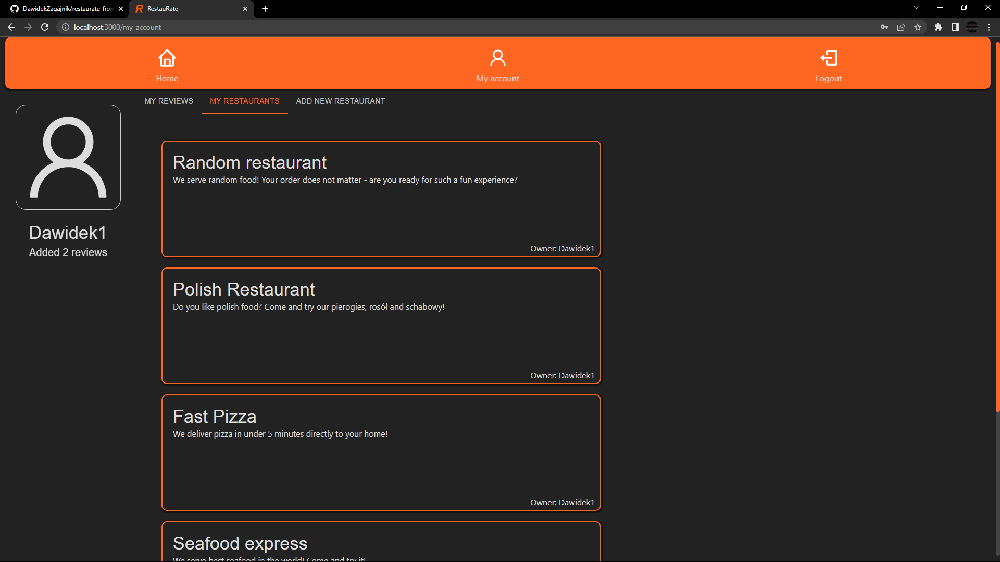
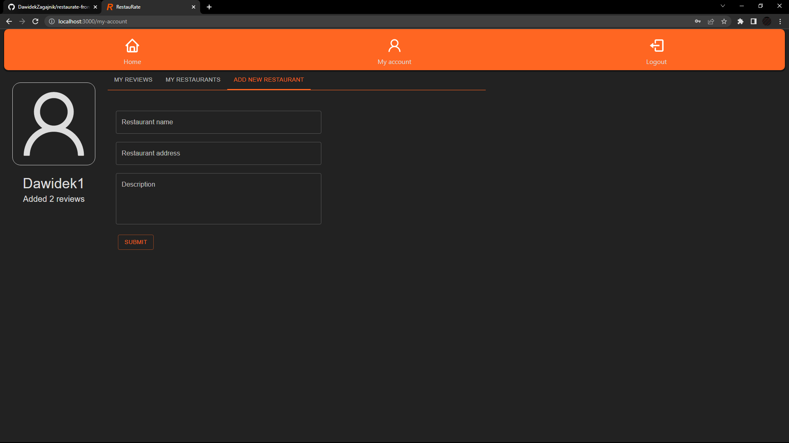

# RestauRate Frontend
This repo contains frontend of RestauRate app, which is a fullstack React-Flask-MySQL-Redis web app for rating restaurants.

## Setup
1. `git clone https://github.com/DawidekZagajnik/restaurate-frontend.git`
2. `docker build -t restaurate-frontend .`
3. `docker run -p 8383:80 -e API_URL="<your-restaurate-api-url>" restaurate-frontend`

## Images
#### Login page:

#### Register page:

#### Home page
Custom auto-load on scroll hook has been used here.

#### Restaurant page

#### User page

